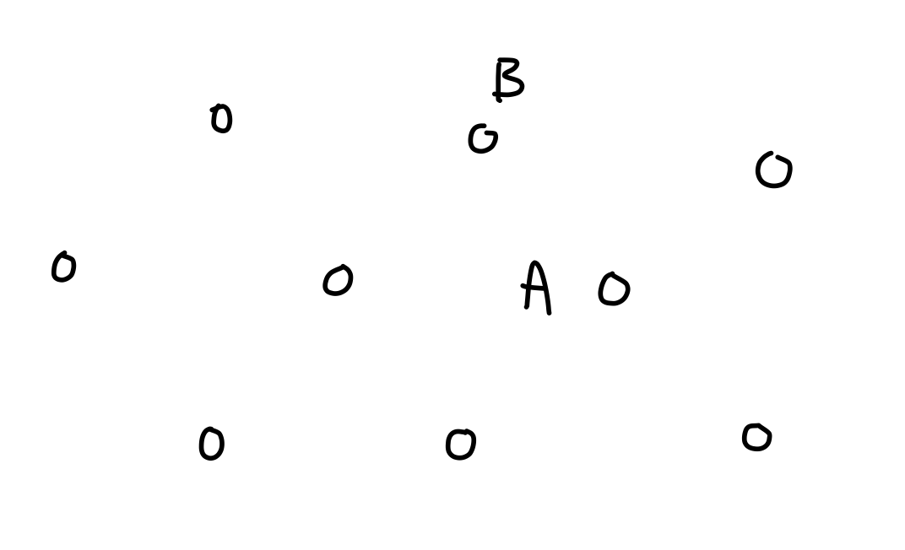
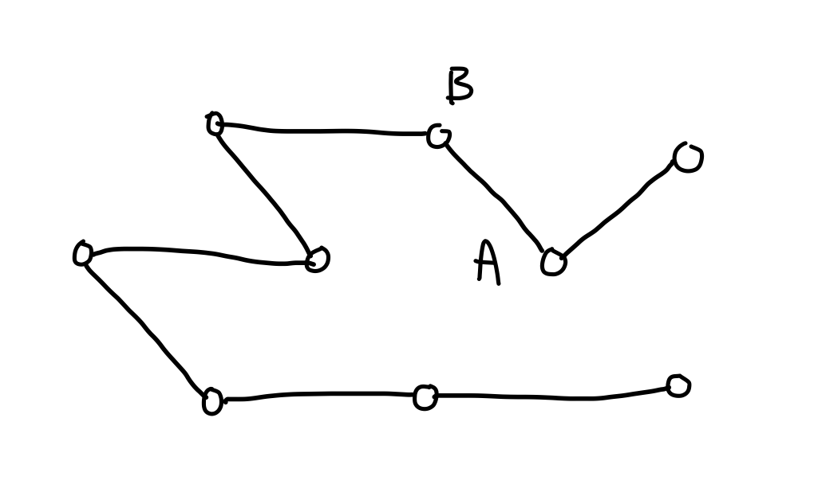
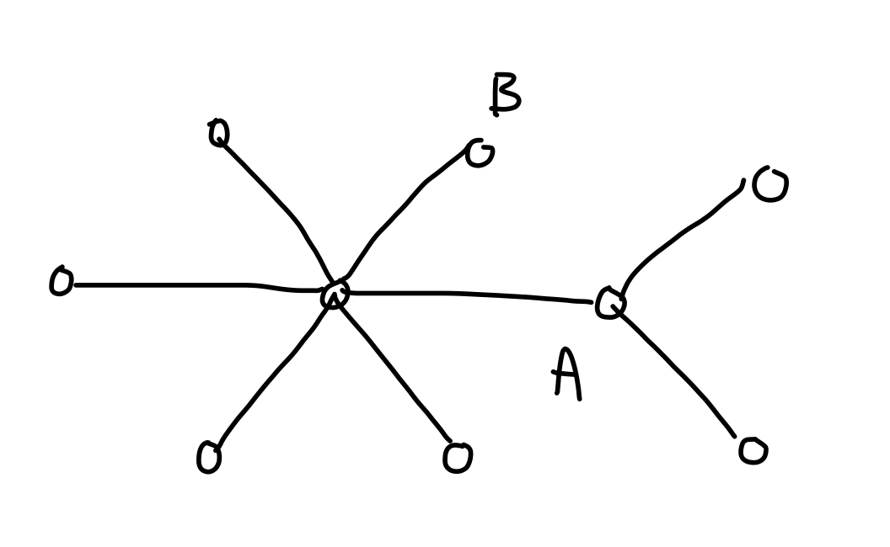

Lecture Summary for Week 1
===================================

READINGS: Sections 16.1, 16.2 (ignore dynamic programming).

Introduction
------------

Course Information Sheet.

Problem: collect raw petrol from 100 oil platforms.
(For runtime, assume \\(10^9\\) ops/sec.)

a. Use a tanker

  - parameters: \\(cost(A,B)\\) for any two platforms \\(A, B\\) -- could be different from distance (natural obstacles, etc.)
  - best algorithm: approx. \\(4 \times 10^{13}\\) years (approx. \\(2^{100}\\) ops \\(10^9\\) ops/sec, i.e. \\(31536000\\) sec/year = \\(40196936841331\\) years = \\(4 \times 10^{13}\\) years)

b. Use pipelines

  - parameters: \\(cost(A,B)\\) for any two platforms \\(A, B\\); no junctions outside platforms
  - best known algorithm: approx. 10 micro-seconds (\\(100^2\\) ops)

c. Add constraint: cannot connect more than 4 pipelines at each platform or any other fixed constant k instead of 4)

  - best known algorithm: approx. \\(4 \times 10^{13}\\) years

d. Ease constraint: allow junctions outside platforms (keep cap on maximum number of pipelines allowed at each junction)
  
  - best known algorithm: still approx. \\(4 \times 10^{13}\\) years

e. Back to tanker: relax requirements to _approximate_ smallest total cost, i.e., cost within factor \\(K\\) of best
  
  - best known algorithm: still approx. \\(4 \times 10^{13}\\) years, irrespective of value of \\(K\\)

f. Add constraint: cost satisfies triangle inequality: for any three platforms \\(A, B, C\\), \\(cost(A,C) \leq cost(A,B) + cost(B,C)\\) (e.g., if cost is directly proportional to distance)
 
  - best known algorithm for relaxed requirement: approx. 1 second

What's the deal?
 
  - \\(P\\): class of problems that have polynomial-time (i.e., "efficient")
    algorithmic solutions
  - \\(NP\text{-hard}\\): class of problems for which no efficient algorithm is known (only known algorithms are exponential time)

Vast majority of real-world problems fall into one of these two classes (P
or NP-hard). Important to recognize problems in each class and to handle
both kinds of problems appropriately.

In this course:
  
  - techniques for writing efficient algorithms for problems in P;
  - techniques for deciding whether a problem is in P or NP-hard;
  - techniques for handling NP-hard problems.

Background (from CSC263 and its prerequisites):
  
  - Asymptotic notation (\\(O, \Omega, \Theta\\), analysis of runtimes for
    iterative and recursive algorithms. [Chapter 2 in textbook]
  - Data structures: queues, stacks, hashing, balanced search trees,
    priority queues, heaps, union-find/disjoint sets.
  - Graphs: definitions, properties, traversal algos (BFS, DFS). [Ch. 3]
  - Induction and other proof techniques, proving correctness of iterative
    and recursive algorithms.

-----------------

Greedy Algorithms
-----------------

"At each step, make the choice that seems best at the time; never change
your mind."

Activity Scheduling.

  - Input: Activities \\(A_1, A_2, \ldots, A_n\\). Each activity \\(A_i\\) consists of positive integer start time \\(s_i\\) and finish time \\(f_i\\): (\\(s_i < f_i\\)).
  - Output: Subset of activities \\(S\\) such that all activities are "compatible" (no two of them overlap in time) and \\(|S|\\) (size of \\(S\\)) is maximum.

TERMINOLOGY: In general, for maximization problem with solution \\(S\\) worth \\(val(S)\\),
  
  - "maximAL" = nothing can be added to \\(S\\) to increase \\(val(S)\\);
  - "maximUM" = no solution has larger value.

A. Brute force: consider each subset of activities.
  - Correctness? Trivial.
  - Runtime? \\(\Omega(2^n)\\), not practical.

B. Greedy by **start time**:
  
        sort activities s.t. s_1 <= s_2 <= ... <= s_n
        S := {}  # partial schedule
        f := 0   # last finish time of activities in S
        for i in [1,2,...,n]:
            if f <= s_i:  # A_i is compatible with S
                S := S U {A_i}
                f := f_i
        return S

  - Runtime? Sorting is \\(\Theta(n \log n)\\), main loop is \\(\Theta(n)\\). Total is \\(\Theta(n \log n)\\).
  - Correctness? Doesn't work. Counter-example:

        |-----------------------------|
          |---| |---| |---| ... |---|

 C. Greedy by **duration**: similar to above except sort by nondecreasing duration, i.e.,
    \\[f_1 - s_1 \leq f_2 - s_2 \leq \ldots \leq f_n - s_n\\]
    
  - Correctness? Counter-example:
        
        |-----| |-----|  |-----| |-----| ... |-----| |-----|
             |---|            |---|               |---|

 D. Greedy by **overlap count**: similar to above except sort from fewest conflicts to most conflicts ("conflict" = overlap with some other activity)
    
  - Correctness? Counter-example:
     
        |---| |---| |---| |---| ... |---| |---| |---| |---|
           |---| |---| |---|           |---| |---| |---|
           |---|       |---|           |---|       |---|
           |---|       |---|           |---|       |---|

 E. Greedy by **finish time**: similar to above except sort by nondecreasing finish time, i.e.,
    \\[f_1 \leq f_2 \leq \ldots \leq f_n\\]
    
  - Correctness? No counter-example...
  - Intuition: algorithm picks activities that "free up" resources as early as posible. BUT: intuition for others also made sense...
  - How to tell if this works? Will show general technique for proving correctness of greedy algorithms.
  - Let \\(S\_0, S\_1, \ldots, S\_n = \text{partial solutions constructed by algo}\\) at the end of each iteration.
  - Two possibilities:
    - Prove each \\(S_i\\) is optimal solution to sub-problem.
      Works for some problems, but does not generalize well (some problems
      don't decompose into sub-problems naturally).
    - Prove each \\(S_i\\) can be "completed" to reach optimal solution.
      Can be trickier but generalizes well.
  - Say \\(S\_i\\) is "promising" if there is some optimal solution OPT that *extends* \\(S\_i\\) using only activities from \\(\{A\_{i+1}, \ldots, A\_n\}\\) (i.e.,
    \\(S\_i \subseteq OPT \subseteq S\_i \cup \{A\_{i+1}, \ldots, A\_n\}\\).
    Note: OPT may not be unique (there may be more than one way to achieve
    optimal).
  - Prove that "\\(S\_i\\) is promising" is a loop invariant, by induction in \\(i\\)
    (number of iterations).
    - Base case: \\(S\_0 = \{\}\\): any optimal solution OPT extends \\(S\_0\\) using only
      activities from \\(\{A\_1, \ldots, A\_n\}\\).
    - Ind. Hyp.: Suppose \\(i \geq 0\\) and optimal OPT extends \\(S\_i\\) using only
      activities from \\(\{A\_{i+1}, \ldots, A\_n\}\\).
    - Ind. Step: To prove: \\(S\_{i+1}\\) is promising w.r.t. \\(\{A\_{i+2}, \ldots, A\_n\}\\).
      From \\(S\_i\\) to \\(S\_{i+1}\\), algo. either rejects or includes \\(A\_{i+1}\\).
      - Case 1:  \\(S\_{i+1} = S\_i\\)
        This means \\(A\_{i+1}\\) not compatible with \\(S\_i\\). Since OPT includes
        \\(S\_i\\), \\(A\_{i+1}\\) is also incompatible with OPT.
        Then OPT extends \\(S\_{i+1}\\) using only activities from
        \\(\{A\_{i+2}, \ldots, A\_n\}\\) (since \\(S\_i \subseteq \text{OPT}\\) and \\(A\_{i+1}\\) not compatible with \\(S\_i \subseteq \text{OPT}\\)).
      - Case 2:  \\(S\_{i+1} = S\_i \cup \{A\_{i+1}\}\\)
        OPT may or may not include \\(A\_{i+1}\\), so consider both
        possibilities.
        - Subcase 2.1:  \\(A\_{i+1} \in \text{OPT}\\)
          Then OPT already extends \\(S\_{i+1}\\) using only activities from
          \\(\{A\_{i+2}, \ldots, A\_n\}\\).

          > NOTE: Every case and subcase so far holds no matter how the activities are sorted initially -- in other words, our proof does not yet depend on the ordering. But we know this is important: it comes into the next subcase.

        - Subcase 2.2:  \\(A_{i+1} \not \in OPT\\)
          
          How can this happen? There must be \\(A\_j \in \text{OPT}\\) that overlaps with \\(A\_{i+1}\\) (otherwise, \\(\text{OPT} \cup A\_{i+1}\\) would be better than optimal OPT). Also, \\(j > i+1\\) because \\(A\_{i+1}\\) is compatible with \\(S\_i\\), so at most one \\(A\_j\\) overlaps \\(A\_{i+1}\\) (otherwise OPT would contain overlapping activities, or an activity outside \\(S\_i\\) but whose finish time is earlier than \\(A\_{i+1}\\), both impossible). Because of sorting, this means \\(f\_j \geq f\_{i+1}\\). But then, \\(\text{OPT'} = \text{OPT} \cup \{A\_{i+1}\} - \{A\_j\}\\) extends \\(S\_{i+1}\\) using \\(\{A\_{i+2}, \ldots, A\_n\}\\): same number of activities as OPT, and no overlap introduced because \\(f\_{i+1} \leq f\_j\\).

          > NOTE: Argument above known as "exchange lemma": arguing that any optimal solution can be made to agree with greedy solution, one element at a time. Just like definition of "extends", every problem and algorithm yields a different "exchange lemma" -- there is no single Exchange Lemma that applies to every algorithm and problem!

        In all cases, there is some optimal \\(\text{OPT}'\\) that extends \\(S\_{i+1}\\) using only activities from \\({A\_{i+2}, \ldots,A\_n}\\).

  - So each \\(S\_i\\) is promising. In particular, \\(S\_n\\) is promising, i.e., there is optimal \\(S^*\_n\\) that "extends" \\(S\_n\\) using only activities from \\(\{\}\\). In other words, \\(S\_n\\) is optimal.
